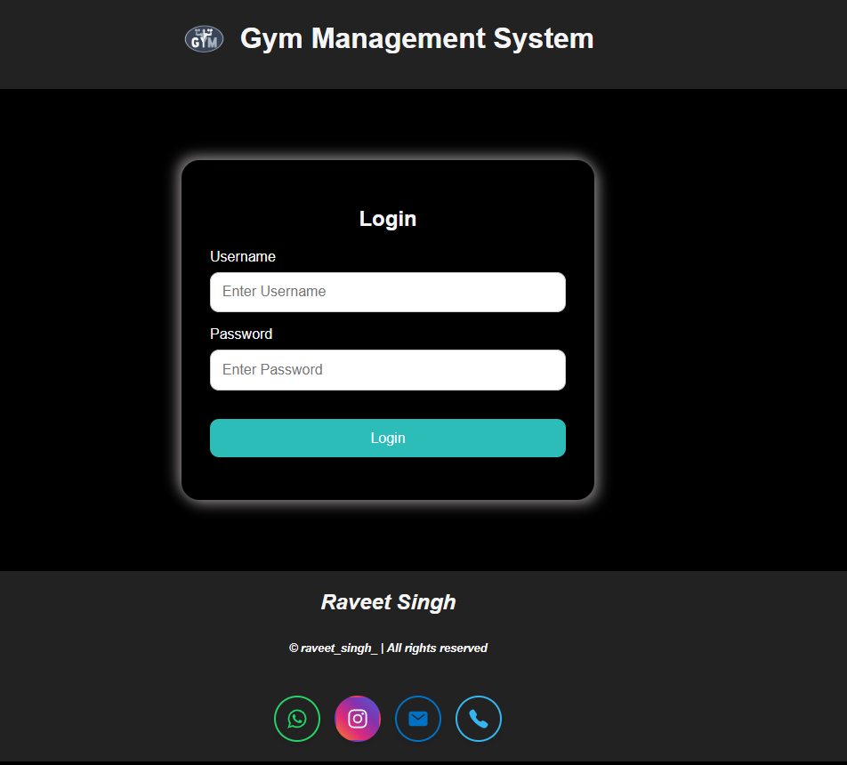
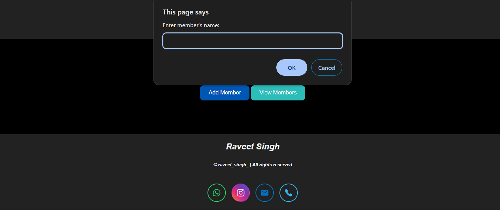
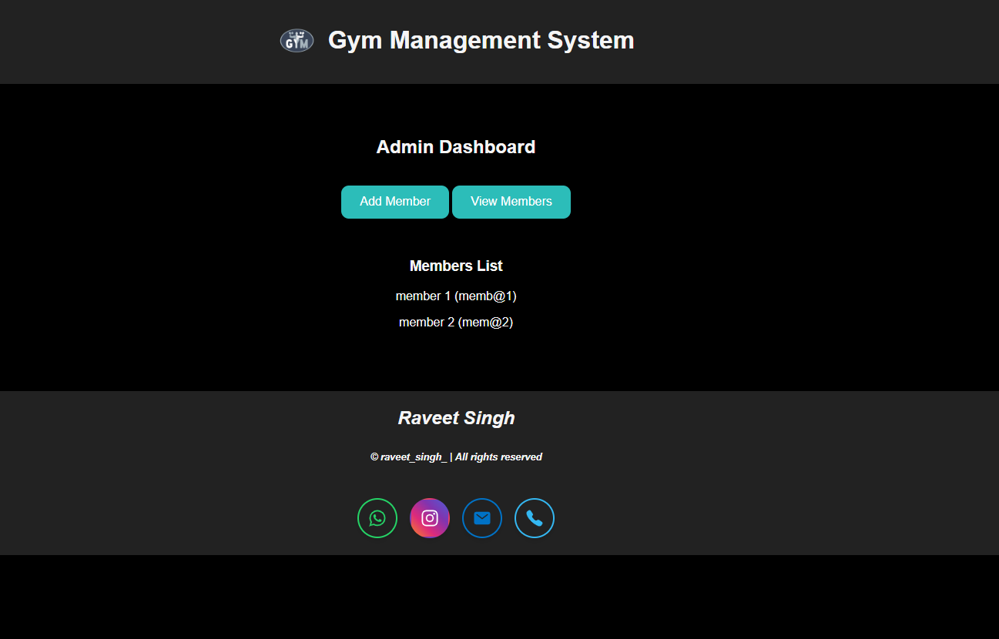

# Gym Management System

A sleek and interactive Gym Management System designed using **HTML**, **CSS**, and **JavaScript**. This project allows gym administrators and members to manage accounts efficiently with a user-friendly interface and responsive design.

---

## 📋 Features

### Admin Features
- Add new gym members with basic details.
- View a dynamically generated list of members.
- Intuitive admin dashboard for quick management.

### Member Features
- Secure login functionality for gym members.
- Personalized member dashboard for improved user experience.

Username: admin
Password: admin123

---

## 🛠️ Technologies Used

- **HTML**: Structuring the application content.
- **CSS**: Designing the layout and styling for the interface.
- **JavaScript**: Adding interactivity and backend simulation using `LocalStorage`.

---

## 🌟 Screenshots

### Login Page

### Admin Dashboard

### Members

